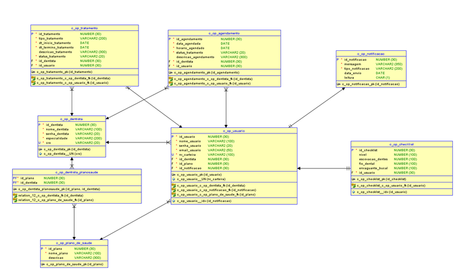
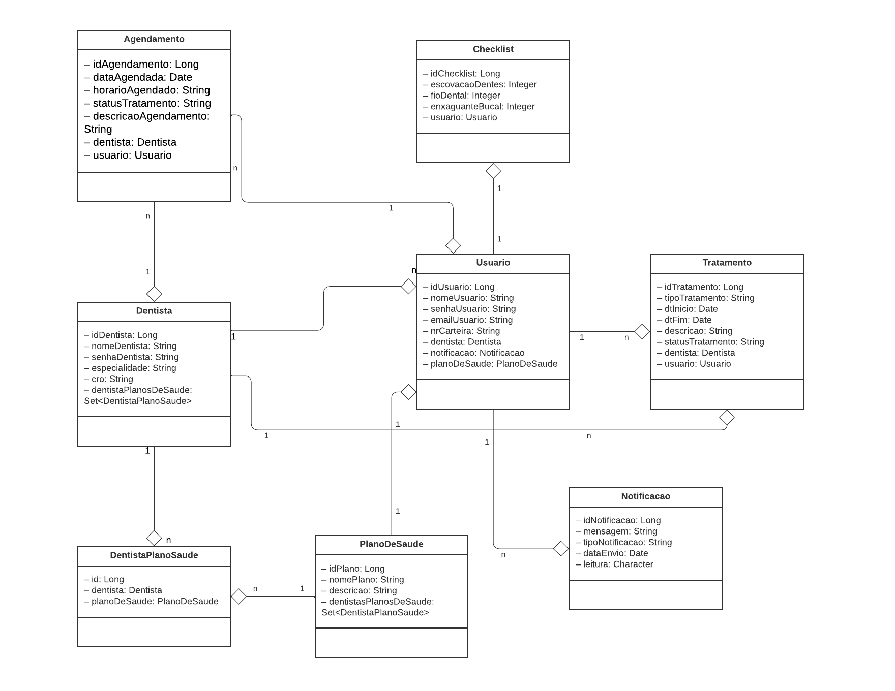

# OdontoFast - Projeto Java Spring Boot
OdontoFast backend é uma aplicação desenvolvida em Java utilizando o framework Spring
Boot, projetada para otimizar a gestão de acompanhamento. O sistema visa melhorar a
comunicação entre dentistas e pacientes, proporcionando uma experiência mais eficiente e
integrada no agendamento de consultas e no acompanhamento de tratamentos. Planejamos
construir através do projeto Java, o backend e API necessários para serem consumidos no
projeto Mobile e Website (admin), e assim ter uma integração absoluta em todo o escopo
definido da solução, incluindo a persistência no banco de dados Oracle.

*PS.: Mais detalhamentos sobre o projeto na pasta 'documentos', no arquivo 'Documentacao_Modelo_App_de_Acompanhamento_Odontológico.pdf'.*


## **Turma, Integrantes do Grupo, RM & Responsabilidades**  
   - **Turma**: 2TDSPS

   - **Felipe Amador/RM:553528**: Responsável por definir o escopo das entidades, criar as classes de entidades e participar da documentação técnica.
   - **Sara Sousa/RM:552656**: Responsável por criar pacotes DTO e Controller, participar da documentação técnica e realização do vídeo.
   - **Leonardo Oliveira/RM:554024**: Responsável por criar pacotes Repository e Service, realizar testes de endpoints e participar da documentação técnica.

## Tecnologias Utilizadas
- Java 17
- Spring Boot 3.3.3
- Oracle Database
- Maven

## **Instrução de Como Rodar a Aplicação**  

   1. Clone o repositório:
      ```bash
      git clone https://github.com/seu_usuario/OdontoFast.git
      ```
   2. Acesse o diretório do projeto:
      ```bash
      cd OdontoFast
      ```
   3. Certifique-se de ter o JDK 17 e Maven instalados.
   4. Compile e inicie a aplicação:
      ```bash
      mvn spring-boot:run
      ```
   5. Acesse a aplicação em: `http://localhost:8080`

   ## **Imagens dos Diagramas**

   **Entidades**
  
   

   **Classes**
   

   ## **Link para Vídeo**  
   [Link para vídeo apresentando a Proposta Tecnológica](URL_do_video)

## **Listagem de Todos os Endpoints**  

**Usuario**
   
| Método | Endpoint                              | Descrição                                 |
|--------|---------------------------------------|-------------------------------------------|
| POST   | /api/usuarios                         | Cria um novo usuário                      |
| GET    | /api/usuarios/{id}                   | Obtém um usuário por ID                   |
| GET    | /api/usuarios                         | Lista todos os usuários                   |
| PUT    | /api/usuarios/{id}                   | Atualiza um usuário                       |
| DELETE | /api/usuarios/{id}                   | Exclui um usuário                         |

**Agendamento**
| Método | Endpoint                              | Descrição                                 |
   |--------|---------------------------------------|-------------------------------------------|
   | POST   | /api/agendamentos                      | Cria um novo agendamento                     |
   | GET    | /api/agendamentos/{id}                   | Obtém um agendamento por ID                   |
   | GET    | /api/agendamentos                        | Lista todos os agendamentos                 |
   | PUT    | /api/agendamentos/{id}                   | Atualiza um agendamento                      |
   | DELETE | /api/agendamentos/{id}                   | Exclui um agendamento                        |

**Checklist**
| Método | Endpoint                              | Descrição                                 |
   |--------|---------------------------------------|-------------------------------------------|
   | POST   | /api/checklists                       | Cria um novo checklist                     |
   | GET    | /api/checklists/{id}                   | Obtém um checklist por ID                   |
   | GET    | /api/checklists                         | Lista todos os checklists                    |
   | PUT    | /api/checklists/{id}                   | Atualiza um checklist                      |
   | DELETE | /api/checklists/{id}                   | Exclui um checklist                     |

   **DentistaPlanoSaude**
   | Método | Endpoint                              | Descrição                                 |
   |--------|---------------------------------------|-------------------------------------------|
   | POST   | /api/dentistaplanosaude/associar        | Cria um novo dentistaplanosaude                     |
   | GET    | /api/dentistaplanosaude/{id}            | Obtém um dentistaplanosaude por ID                   |
   | GET    | /api/dentistaplanosaude                 | Lista todos os dentistaplanosaude                  |
   | PUT    | /api/dentistaplanosaude/{id}            | Atualiza um dentistaplanosaude                      |
   | DELETE | /api/dentistaplanosaude/{id}            | Exclui um dentistaplanosaude                       |

   **Dentistas**
   | Método | Endpoint                              | Descrição                                 |
   |--------|---------------------------------------|-------------------------------------------|
   | POST   | /api/dentistas                         | Cria um novo dentista                     |
   | GET    | /api/dentistas/{id}                   | Obtém um dentista por ID                   |
   | GET    | /api/dentistas                      | Lista todos os dentistas                  |
   | PUT    | /api/dentistas/{id}                   | Atualiza um dentista                     |
   | DELETE | /api/usuarios/{id}                   | Exclui um dentista                        |

   **Notificacoes**
   | Método | Endpoint                              | Descrição                                 |
   |--------|---------------------------------------|-------------------------------------------|
   | POST   | /api/notificacoes                        | Cria uma nova notificação                   |
   | GET    | /api/notificacoes/{id}                   | Obtém uma nova notificação por ID                   |
   | GET    | /api/notificacoes                         | Lista todos as notificações                  |
   | PUT    | /api/notificacoes/{id}                   | Atualiza uma notificação                       |
   | DELETE | /api/notificacoes/{id}                   | Exclui uma notificação                        |

   **PlanosSaude**
   | Método | Endpoint                              | Descrição                                 |
   |--------|---------------------------------------|-------------------------------------------|
   | POST   | /api/planos                      | Cria um novo plano de saúde                    |
   | GET    | /api/planos/{id}                   | Obtém um plano de saúde por ID                   |
   | GET    | /api/planos                         | Lista todos os planos de saúde                  |
   | PUT    | /api/planos/{id}                   | Atualiza um plano de saúde                      |
   | DELETE | /api/planos/{id}                   | Exclui um plano de saúde                         |

   **Tratamentos**
   | Método | Endpoint                              | Descrição                                 |
   |--------|---------------------------------------|-------------------------------------------|
   | POST   | /api/tratamentos                         | Cria um novo tratamento                    |
   | GET    | /api/tratamentos/{id}                   | Obtém tratamento por ID                   |
   | GET    | /api/tratamentos                        | Lista todos os tratamentos                   |
   | PUT    | /api/tratamentos/{id}                   | Atualiza um tratamento                       |
   | DELETE | /api/tratamentos/{id}                   | Exclui um tratamento                       |

*PS.: Collections contendo todas as estruturas de requisições para teste no Postman na pasta 'documentos' no arquivo 'OdontoFast.postman_collection.json'.*
