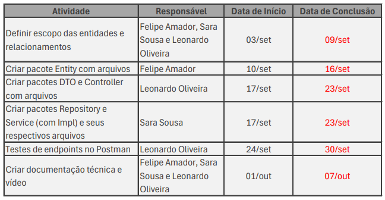
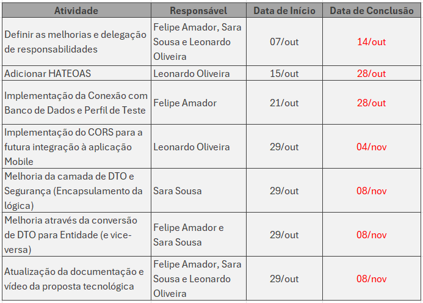

# OdontoFast - Solução Geral
**Público-alvo:**
O público-alvo da nossa aplicação são principalmente adultos entre 25 e 45 anos, que representam a faixa etária com maior frequência de acionamento de sinistros relacionados à saúde bucal. Essa faixa é a que mais necessita de cuidados preventivos para evitar tratamentos curativos custosos e, muitas vezes, invasivos, que poderiam ser evitados com um acompanhamento adequado.

**Problema e Solução:**
A nossa aplicação tem como objetivo oferecer uma solução que incentive bons hábitos de saúde bucal, promova a utilização dos planos preventivos e reduza os sinistros relacionados a tratamentos curativos. Com isso, os pacientes poderão acompanhar de forma clara e transparente o andamento de seus tratamentos, enquanto os dentistas terão um controle eficiente sobre as ações tomadas pelos pacientes. Além disso, a aplicação facilita o monitoramento, por parte da Odontoprev, do estado de saúde bucal de cada paciente e das intervenções dos dentistas, garantindo uma melhor transparência e eficiência no cuidado preventivo.


# OdontoFast - Projeto Java Spring Boot
O backend do OdontoFast é uma aplicação desenvolvida em Java, utilizando o framework Spring Boot, com o objetivo de otimizar o acompanhamento odontológico preventivo. 

A solução foi projetada para melhorar a comunicação entre dentistas e pacientes, promovendo uma experiência integrada e eficiente no agendamento de consultas e no acompanhamento de tratamentos.

Nosso projeto visa implementar todo o backend necessário, incluindo a API RESTful, que será consumida tanto pela aplicação mobile quanto pelo website administrativo. Dessa forma, garantimos uma integração completa entre as plataformas, permitindo uma gestão centralizada e fluida dos dados, além de uma persistência confiável no banco de dados Oracle.

A aplicação não apenas facilita a transparência e o monitoramento do tratamento por parte dos pacientes, como também oferece aos dentistas um controle preciso sobre os cuidados preventivos realizados. Tudo isso, visando a redução de sinistros e a promoção de bons hábitos de saúde bucal, alinhando-se diretamente à proposta da nossa solução tecnológica.

## **Turma, Integrantes do Grupo, RM & Responsabilidades**  
   - **Turma**: 2TDSPS

### Sprint 1:
   - **Felipe Amador/RM:553528**: Responsável por definir o escopo das entidades, criar as classes de entidades e participar da documentação técnica.
   - **Sara Sousa/RM:552656**: Responsável por criar pacotes DTO e Controller, participar da documentação técnica e realização do vídeo.
   - **Leonardo Oliveira/RM:554024**: Responsável por criar pacotes Repository e Service, realizar testes de endpoints e participar da documentação técnica.

### Sprint 2:
   - **Felipe Amador/RM:553528**: Responsável por Definir as melhorias e delegação de responsabilidades, Implementação da Conexão com Banco de Dados e Perfil de Teste, Melhoria através da conversão de DTO para Entidade (e vice-versa) e Atualização da documentação e vídeo da proposta tecnológica.
   - **Sara Sousa/RM:552656**: Responsável por Definir as melhorias e delegação de responsabilidades, Melhoria da camada de DTO e Segurança (Encapsulamento da lógica), Melhoria através da conversão de DTO para Entidade (e vice-versa) e Atualização da documentação e vídeo da proposta tecnológica.
   - **Leonardo Oliveira/RM:554024**: Responsável por Definir as melhorias e delegação de responsabilidades, Adicionar HATEOAS, Implementação do CORS para a futura integração à aplicação Mobile e Atualização da documentação e vídeo da proposta tecnológica

## **Cronograma de Desenvolvimento**

### Sprint 1


### Sprint 2


## Tecnologias Utilizadas
- Java 17
- Spring Boot 3.3.3
- Oracle Database
- H2 Database (para testes)
- Maven

## Destaques Técnicos de Atualização

### 1. Camada de DTO e Segurança
- Os controladores agora utilizam DTOs, como `UsuarioDTO` e `DentistaPlanoSaudeDTO`, para transferência de dados
- Essa abordagem encapsula a lógica e melhora a segurança ao evitar a exposição direta das entidades

### 2. Conversão de DTO para Entidade
- Foram adicionados métodos para converter DTOs para entidades e vice-versa em controladores como `UsuarioController` e `DentistaPlanoSaudeController`
- Garante consistência na manipulação de dados

### 3. HATEOAS para Navegação Melhorada
- O projeto agora implementa links HATEOAS aprimorados nos controladores
- Permite uma navegação mais intuitiva e autodescritiva

### 4. Configuração de CORS
- Uma classe de configuração `CorsConfig` foi implementada
- Permite requisições de endereços específicos, facilitando a integração com clientes, como emuladores Android

### 5. Conexões com Banco de Dados e Perfil de Teste
- A aplicação é configurada para conectar-se ao banco de dados Oracle em produção
- Utiliza banco em memória H2 em ambientes de teste
- No perfil de teste (`test`), a aplicação carrega um arquivo `import.sql` para popular automaticamente o banco com dados iniciais

## Configurações

### Arquivo application.properties

```properties
# Configuração de perfil para H2
spring.profiles.active=test

# Configuração para H2
spring.datasource.url=jdbc:h2:mem:odontoprev
spring.datasource.driverClassName=org.h2.Driver
spring.datasource.username=sa
spring.datasource.password=
spring.h2.console.enabled=true
spring.sql.init.data-locations=classpath:import.sql # Comando para popular com dados iniciais
```

## **Instrução de Como Rodar a Aplicação**  

   1. Clone o repositório:
      ```bash
      git clone https://github.com/sousa-sara/odontofast-java-springboot.git
      ```
   2. Acesse o diretório do projeto:
      ```bash
      cd odontofast-java-springboot
      cd demo
      ```
   3. Certifique-se de ter o JDK 17 e Maven instalados.
   4. Compile e inicie a aplicação:
      ```bash
      mvn spring-boot:run
      ```
   5. Acesse a aplicação em: `http://localhost:8080`
   6. Teste localmente com: `http://localhost:8080/api/usuarios`
   7. Para testes mais aprofundados com Postman, acessar o arquivo json na pasta 'documentos' de nome 'OdontoFast.postman_collection.json'.

   ## **Imagens dos Diagramas**

   **Entidades**
  
   

   **Classes**
   
   

   *PS.: Mais detalhamentos sobre o projeto na pasta 'documentos', no arquivo 'Documentacao_Modelo_App_de_Acompanhamento_Odontológico.pdf'.*

   ## **Link para Vídeo**  
   [Link para vídeo apresentando a Proposta Tecnológica](https://drive.google.com/file/d/1PLQXwP-C8_bW0AqzS9P1nhGlPPuoBKqa/view?usp=sharing)

## **Listagem de Todos os Endpoints**  

**Usuario**
   
| Método | Endpoint                              | Descrição                                 |
|--------|---------------------------------------|-------------------------------------------|
| POST   | /api/usuarios                         | Cria um novo usuário                      |
| GET    | /api/usuarios/{id}                   | Obtém um usuário por ID                   |
| GET    | /api/usuarios                         | Lista todos os usuários                   |
| PUT    | /api/usuarios/{id}                   | Atualiza um usuário                       |
| DELETE | /api/usuarios/{id}                   | Exclui um usuário                         |

**Agendamento**
| Método | Endpoint                              | Descrição                                 |
   |--------|---------------------------------------|-------------------------------------------|
   | POST   | /api/agendamentos                      | Cria um novo agendamento                     |
   | GET    | /api/agendamentos/{id}                   | Obtém um agendamento por ID                   |
   | GET    | /api/agendamentos                        | Lista todos os agendamentos                 |
   | PUT    | /api/agendamentos/{id}                   | Atualiza um agendamento                      |
   | DELETE | /api/agendamentos/{id}                   | Exclui um agendamento                        |

**Checklist**
| Método | Endpoint                              | Descrição                                 |
   |--------|---------------------------------------|-------------------------------------------|
   | POST   | /api/checklists                       | Cria um novo checklist                     |
   | GET    | /api/checklists/{id}                   | Obtém um checklist por ID                   |
   | GET    | /api/checklists                         | Lista todos os checklists                    |
   | PUT    | /api/checklists/{id}                   | Atualiza um checklist                      |
   | DELETE | /api/checklists/{id}                   | Exclui um checklist                     |

   **DentistaPlanoSaude**
   | Método | Endpoint                              | Descrição                                 |
   |--------|---------------------------------------|-------------------------------------------|
   | POST   | /api/dentistaplanosaude/associar        | Cria um novo dentistaplanosaude                     |
   | GET    | /api/dentistaplanosaude/{id}            | Obtém um dentistaplanosaude por ID                   |
   | GET    | /api/dentistaplanosaude                 | Lista todos os dentistaplanosaude                  |
   | PUT    | /api/dentistaplanosaude/{id}            | Atualiza um dentistaplanosaude                      |
   | DELETE | /api/dentistaplanosaude/{id}            | Exclui um dentistaplanosaude                       |

   **Dentistas**
   | Método | Endpoint                              | Descrição                                 |
   |--------|---------------------------------------|-------------------------------------------|
   | POST   | /api/dentistas                         | Cria um novo dentista                     |
   | GET    | /api/dentistas/{id}                   | Obtém um dentista por ID                   |
   | GET    | /api/dentistas                      | Lista todos os dentistas                  |
   | PUT    | /api/dentistas/{id}                   | Atualiza um dentista                     |
   | DELETE | /api/usuarios/{id}                   | Exclui um dentista                        |

   **Notificacoes**
   | Método | Endpoint                              | Descrição                                 |
   |--------|---------------------------------------|-------------------------------------------|
   | POST   | /api/notificacoes                        | Cria uma nova notificação                   |
   | GET    | /api/notificacoes/{id}                   | Obtém uma nova notificação por ID                   |
   | GET    | /api/notificacoes                         | Lista todos as notificações                  |
   | PUT    | /api/notificacoes/{id}                   | Atualiza uma notificação                       |
   | DELETE | /api/notificacoes/{id}                   | Exclui uma notificação                        |

   **PlanosSaude**
   | Método | Endpoint                              | Descrição                                 |
   |--------|---------------------------------------|-------------------------------------------|
   | POST   | /api/planos                      | Cria um novo plano de saúde                    |
   | GET    | /api/planos/{id}                   | Obtém um plano de saúde por ID                   |
   | GET    | /api/planos                         | Lista todos os planos de saúde                  |
   | PUT    | /api/planos/{id}                   | Atualiza um plano de saúde                      |
   | DELETE | /api/planos/{id}                   | Exclui um plano de saúde                         |

   **Tratamentos**
   | Método | Endpoint                              | Descrição                                 |
   |--------|---------------------------------------|-------------------------------------------|
   | POST   | /api/tratamentos                         | Cria um novo tratamento                    |
   | GET    | /api/tratamentos/{id}                   | Obtém tratamento por ID                   |
   | GET    | /api/tratamentos                        | Lista todos os tratamentos                   |
   | PUT    | /api/tratamentos/{id}                   | Atualiza um tratamento                       |
   | DELETE | /api/tratamentos/{id}                   | Exclui um tratamento                       |

*PS.: Collections contendo todas as estruturas de requisições para teste no Postman na pasta 'documentos' no arquivo 'OdontoFast.postman_collection.json'.*

# Conclusão

Em resumo, o OdontoFast se posiciona como uma solução tecnológica inovadora que visa transformar a gestão odontológica, promovendo o tratamento preventivo e reduzindo os sinistros decorrentes de cuidados curativos. Com o desenvolvimento do backend em Java utilizando Spring Boot, e a integração com plataformas mobile e web, garantimos uma aplicação robusta, que oferece transparência, eficiência e facilidade no acompanhamento dos tratamentos tanto para pacientes quanto para dentistas. Ao centralizar todas as informações e ações em um sistema confiável, proporcionamos uma experiência completa e integrada, alinhada ao objetivo de incentivar bons hábitos de saúde bucal e melhorar o atendimento preventivo.
